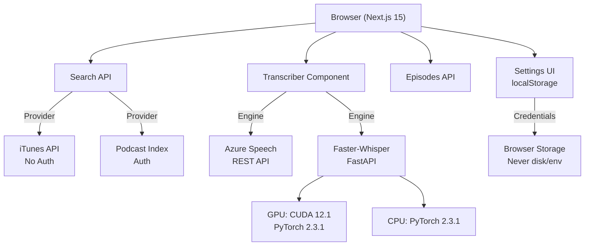

# Agents & System Notes

## Architecture



## Transcription Engines Comparison

| Feature | Azure Speech | Faster-Whisper |
|---------|-------------|----------------|
| **Latency** | ~1-3s | 5-15s (GPU), 30-60s (CPU) |
| **Accuracy** | ✓✓ Excellent | ✓✓ Excellent |
| **Cost** | $$ (pay-per-minute) | Free (local) |
| **Privacy** | Cloud | On-machine |
| **Dependencies** | Network + API key | Docker + GPU optional |
| **Multi-language** | ✓✓ Excellent | ✓✓ Excellent |
| **Best for** | Production + accuracy | Privacy + accuracy |

## Search Providers Comparison

| Aspect | iTunes | Podcast Index |
|--------|--------|---------------|
| **Authentication** | None | API Key + Secret (SHA1) |
| **Storage** | N/A | localStorage (browser only) |
| **Coverage** | ~2M podcasts | ~3M podcasts + metadata |
| **Rate Limit** | Generous (~200/min) | Pro: unlimited |
| **Setup** | Zero config | User-configured in Settings |

## Request Flow: Search with Podcast Index

```
1. User enters query + credentials in Settings
   ↓ Stored in browser localStorage
   ↓
2. Frontend: /api/search?q=term
   Headers: x-podcastindex-key, x-podcastindex-secret
   ↓
3. Backend: Validates headers, computes HMAC-SHA1(key+secret+timestamp)
   ↓
4. Calls Podcast Index API with auth header
   ↓
5. Returns normalized feed objects (id, title, author, image, url)
```

## Privacy & Data Flow

- **Azure Speech**: Audio → Microsoft cloud, transcripts returned locally, credentials never disk-stored
- **Faster-Whisper**: Audio → your GPU/CPU, transcripts local, zero cloud calls
- **Search Keys**: Browser localStorage only (JSON stringify), never sent to app server
- **Podcast Index Auth**: via headers, keys sent only to Podcast Index

## Frontend Stack

- **Framework**: Next.js 15.5.7 + React 18 + TypeScript
- **Styling**: Tailwind CSS + shadcn/ui
- **APIs**:  Azure Speech (REST), Faster-Whisper (FastAPI)
- **State**: React hooks + localStorage
- **UI Components**: Button, Card, Input, Switch, Tabs, Badge, Slider, Skeleton, ScrollArea

## Development

**No environment files (.env) needed**:
- Podcast Index credentials → User enters in Settings UI
- Azure Speech credentials → User enters in Settings UI  
- All credentials stored in browser (localStorage), sent via request headers or form data
- Docker: `docker-compose -f docker-compose.gpu.yml up` or `.cpu.yml`

**Model cache**: `/root/.cache/huggingface/hub` (mounted in Docker)

## Deployment to Azure

| Option | Use Case | GPU | Setup |
|--------|----------|-----|-------|
| **Container App** | MVP, Production | Optional | `infra/container-app/deploy.sh` |
| **ACI** | Testing | ✗ (GPU retired July 2025) | `infra/aci/deploy.sh` |
| **App Service** | CPU Production | ✗ | `infra/app-service/deploy.sh` |
| **AKS** | Enterprise Scale | ✓ | `infra/aks/deploy.sh` |

ACI: Azure Container Instances  
AKS: Azure Kubernetes Service

### Shared Resources (all deployments use)
- **Azure Container Registry** - Hosts CPU & GPU images
- **Azure Speech Service** - S0 tier for transcription
- **Log Analytics** (optional) - for monitoring and diagnostics

### Setup & Deployment

**1. Setup shared resources (ACR + Speech Service)**
```bash
./infra/setup.sh <resource-group> <location> <acr-name> <speech-name> [--build-images]
```
- Creates resource group, deploys ACR and Speech Service via Bicep
- Outputs ACR credentials and Speech Service endpoint
- Optional `--build-images` to build and push Docker images to ACR
- Example: `./infra/setup.sh podcast-ack eastus podcastack podcast-transcribe --build-images`

**2. Deploy to compute platform (pick one)**
```bash
# Container Apps (MVP, optional GPU via container image)
./infra/container-app/deploy.sh <rg> <location> <acr-name> <variant>
# Example: ./infra/container-app/deploy.sh podcast-ack eastus podcastack cpu

# Azure Container Instances (CPU-only, GPU retired July 2025)
./infra/aci/deploy.sh <rg> <location> <acr-name>

# App Service (CPU production)
./infra/app-service/deploy.sh <rg> <location> <app-name> <acr-name>

# Azure Kubernetes Service (enterprise scale, GPU capable)
./infra/aks/deploy.sh <rg> <location> <cluster-name> <acr-name>
```

**3. Test all deployments**
```bash
./test-all-deploy.sh <resource-group> <location> <acr-name> <speech-name> [--build-images] [--target container-app|aci|app-service|aks|all]
```
- Runs setup and deploys to selected target(s)
- Example: `./test-all-deploy.sh podcast-ack eastus podcastack podcast-speech-ack --build-images --target all`
- In Powershell: `bash -c "./test-all-deploy.sh podcast-ack eastus podcastack podcast-speech-ack --build-images --target all"`

**4. Cleanup**
```bash
./infra/cleanup.sh <resource-group> [--force]
```
- Deletes resource group and all resources
- Prompts for confirmation unless `--force` is used
- Example: `./infra/cleanup.sh podcast-ack --force`

### Scripts Overview
- `setup.sh` - Deploy ACR and Speech Service via Bicep, optionally build images
- `test-all-deploy.sh` - Test all 4 deployment methods in sequence
- `cleanup.sh` - Delete resource group and all resources
- Individual `deploy.sh` scripts in each platform folder orchestrate platform-specific deployment

## Why CUDA 12.1 (current choice):

- Broader hardware support - Works with RTX 30xx, 40xx, A100, H100, L4, T4, and older GPUs  
- cuDNN 8 is production-proven - Stable, widely tested, known performance characteristics  
- Better driver compatibility - Works with a wider range of NVIDIA driver versions  
- Safer for production - Less risk of runtime surprises  

When to use CUDA 13.0:

✓ You have very new GPUs (H100/L40 clusters) requiring 13.0
✓ You need the latest cuDNN 9 performance optimizations
✓ Your infrastructure explicitly requires CUDA 13.0+
