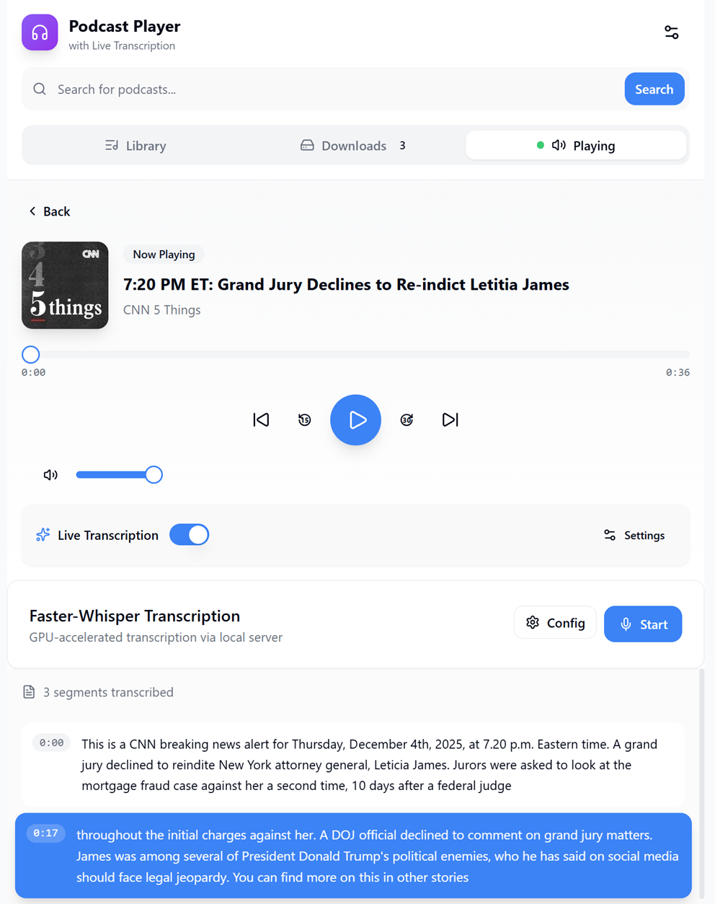

# Podcast Player

Lean podcast player with multi-engine transcription and switchable search providers.  
A demo application to evaluate multiple options for Azure application deployments.  

## What it does
- Play, subscribe, download (**supports local download**), and resume podcasts
- Live transcripts: ☁️ Azure Speech, ⚡ Faster-Whisper
- Choose search source: iTunes (no auth) or Podcast Index (user key/secret)
- Extract & learn: extracts idiomatic phrases, phrasal verbs, collocations from transcripts

## Run it
```bash
npm install
npm run dev
# open http://localhost:3000
# Optional (Faster-Whisper):
# cd infra && uv sync && uv run faster_whisper_server.py
```

## Screen



## Search sources
- **iTunes (default):** free, no credentials
- **Podcast Index:** add your key + secret in Settings → Search

## Transcription engines
- **Azure Speech:** cloud accuracy, needs your Azure key/region (saved locally)
- **Faster-Whisper:** self-hosted FastAPI server (python)

## Language Learning
- **Extract Expressions:** OpenAI or Azure OpenAI (configure in Settings) extracts idiomatic phrases, phrasal verbs, collocations from transcripts
- **Targets intermediate English learners** 
- **Export:** Download expressions as CSV

## Privacy
- API keys and server URLs live in your browser storage only. (no .env file)
- Azure sends to Microsoft; Faster-Whisper stays local.

## Deploy
- See [AGENTS.md](AGENTS.md#deployment-to-azure) for PowerShell deployment steps (Container Apps, ACI, App Service, AKS).
